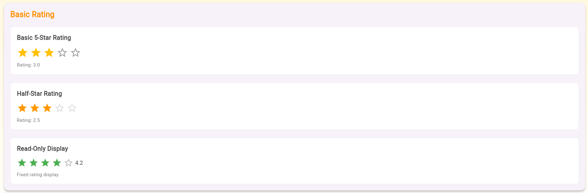
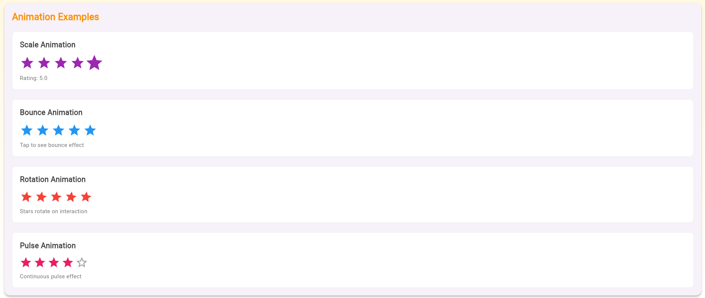
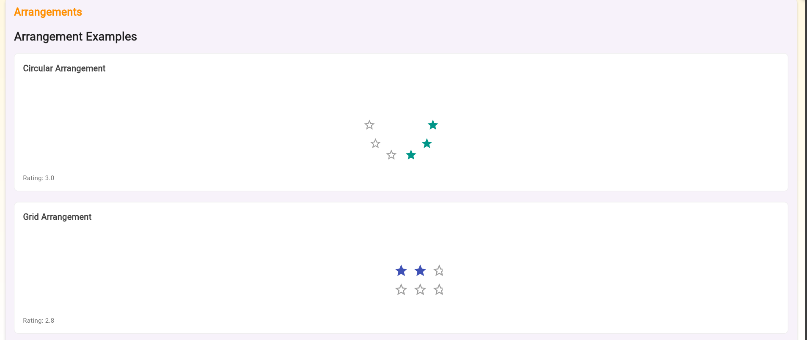
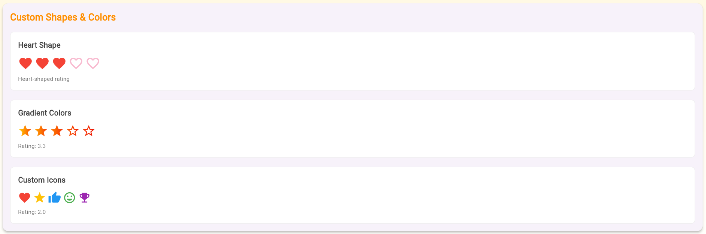
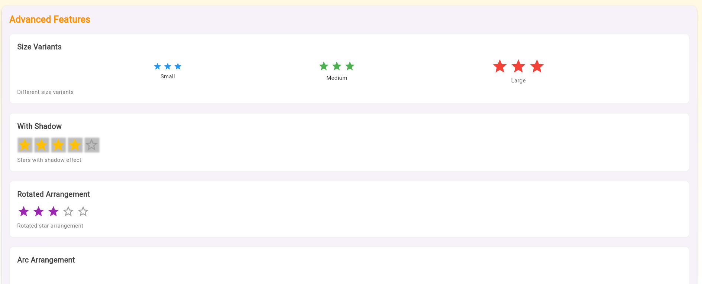
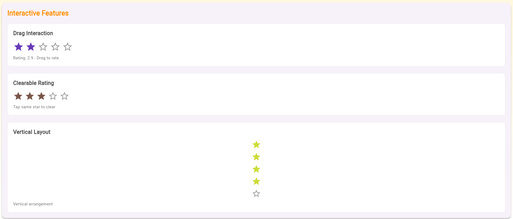
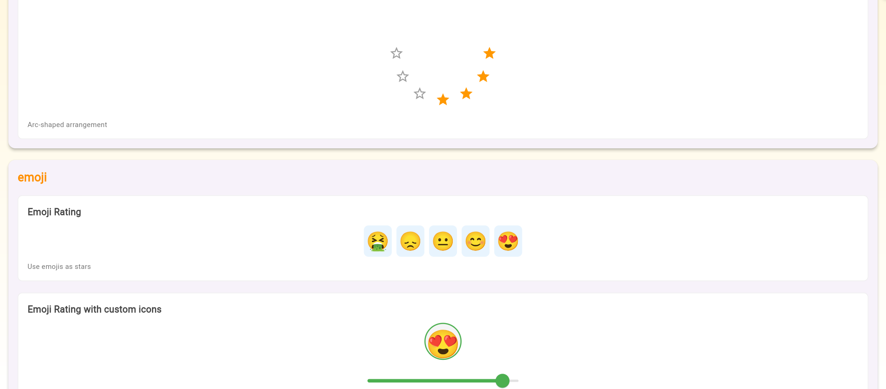

# ✨ Easy Stars: Your Flutter Rating Solution! ✨

Add a touch of sparkle to your Flutter app with **Easy Stars** — the all-in-one solution for elegant and customizable rating widgets.

---

## 🚀 Getting Started

Add to your `pubspec.yaml`:

```yaml
dependencies:
  easy_stars: ^1.0.3
````

Then:

```bash
flutter pub get
```

---

## 💡 Example Usage

Below are rich examples showcasing the versatility of Easy Stars:

---

## 1️⃣ Basic Ratings



### 🌟 Basic 5-Star Rating

```dart
EasyStarsRating(
  initialRating: 3.0,
  onRatingChanged: (value) {
    setState(() {
      _rating = value;
    });
  },
)
```

---

### ⭐ Half-Star Rating

```dart
EasyStarsRating(
  initialRating: 2.5,
  allowHalfRating: true,
  filledColor: Colors.orange,
  onRatingChanged: (value) {
    setState(() {
      _rating = value;
    });
  },
)
```

---

### ✅ Read-Only Display

```dart
EasyStarsDisplay(
  initialRating: 4.2,
  readOnly: true,
  filledColor: Colors.green,
)
```

---

## 2️⃣ Animations



### 💫 Scale Animation

```dart
EasyStarsRating(
  initialRating: 4.0,
  animationConfig: StarAnimationConfig.scale,
  filledColor: Colors.purple,
  onRatingChanged: (value) {
    setState(() {
      _rating = value;
    });
  },
)
```

---

### 💫 Bounce Animation

```dart
EasyStarsRating(
  initialRating: 3.0,
  animationConfig: StarAnimationConfig.bounce,
  filledColor: Colors.blue,
  onRatingChanged: (value) {
    setState(() {
      _rating = value;
    });
  },
)
```

---

### 💫 Rotation Animation

```dart
EasyStarsRating(
  initialRating: 4.0,
  animationConfig: StarAnimationConfig.rotate,
  filledColor: Colors.red,
  onRatingChanged: (value) {
    setState(() {
      _rating = value;
    });
  },
)
```

---

### 💫 Pulse Animation

```dart
EasyStarsRating(
  initialRating: 3.5,
  animationConfig: StarAnimationConfig.pulse,
  filledColor: Colors.pink,
  onRatingChanged: (value) {
    setState(() {
      _rating = value;
    });
  },
)
```

---

## 3️⃣ Arrangements



### 🌀 Arc Arrangement

```dart
EasyStarsRating(
  initialRating: 4.0,
  starCount: 7,
  arrangement: StarArrangement.arc,
  arrangementRadius: 80,
  filledColor: Colors.orange,
  onRatingChanged: (value) {
    setState(() {
      _rating = value;
    });
  },
)
```

---

### 🟦 Grid Arrangement

```dart
EasyStarsRating(
  initialRating: 3.0,
  arrangement: StarArrangement.grid,
  gridColumns: 3,
  filledColor: Colors.indigo,
  onRatingChanged: (value) {
    setState(() {
      _rating = value;
    });
  },
)
```

---

### 🌊 Wave Arrangement

```dart
EasyStarsRating(
  initialRating: 3.5,
  arrangement: StarArrangement.wave,
  waveAmplitude: 15,
  filledColor: Colors.cyan,
  onRatingChanged: (value) {
    setState(() {
      _rating = value;
    });
  },
)
```

---

### 🌀 Spiral Arrangement

```dart
EasyStarsRating(
  initialRating: 4.0,
  arrangement: StarArrangement.spiral,
  arrangementRadius: 50,
  filledColor: Colors.deepOrange,
  onRatingChanged: (value) {
    setState(() {
      _rating = value;
    });
  },
)
```

---

## 4️⃣ Custom Shapes & Colors



### ❤️ Heart Shape

```dart
EasyStarsRating(
  initialRating: 3.5,
  starShape: StarShape.heart,
  filledColor: Colors.red,
  emptyColor: Colors.pink.shade100,
  onRatingChanged: (value) {
    setState(() {
      _rating = value;
    });
  },
)
```

---

### 🎨 Gradient Colors

```dart
EasyStarsRating(
  initialRating: 3.3,
  gradientColors: [Colors.yellow, Colors.orange, Colors.red],
  onRatingChanged: (value) {
    setState(() {
      _rating = value;
    });
  },
)
```

---

### ⭐ Custom Icons

```dart
EasyStarsRating(
  initialRating: 3.6,
  customIcons: [
    Icons.favorite,
    Icons.star,
    Icons.thumb_up,
    Icons.mood,
    Icons.emoji_events,
  ],
  customColors: [
    Colors.red,
    Colors.amber,
    Colors.blue,
    Colors.green,
    Colors.purple,
  ],
  onRatingChanged: (value) {
    setState(() {
      _rating = value;
    });
  },
)
```

---

## 5️⃣ Advanced Features



### 🔹 Size Variants

```dart
Row(
  children: [
    EasyStarsRating(
      initialRating: 3.0,
      sizeVariant: StarSizeVariant.small,
    ),
    EasyStarsRating(
      initialRating: 3.0,
      sizeVariant: StarSizeVariant.medium,
    ),
    EasyStarsRating(
      initialRating: 3.0,
      sizeVariant: StarSizeVariant.large,
    ),
  ],
)
```

---

### 🔹 Shadow Effect

```dart
EasyStarsRating(
  initialRating: 4.0,
  starShadow: BoxShadow(
    color: Colors.black26,
    blurRadius: 2,
    offset: Offset(1, 1),
  ),
  filledColor: Colors.amber,
  onRatingChanged: (value) {
    setState(() {
      _rating = value;
    });
  },
)
```

---

### 🔹 Rotated Arrangement

```dart
EasyStarsRating(
  initialRating: 3.5,
  arrangementRotation: 0.2,
  filledColor: Colors.purple,
  onRatingChanged: (value) {
    setState(() {
      _rating = value;
    });
  },
)
```

---

## 6️⃣ Interactions



### 🟢 Drag Interaction

```dart
EasyStarsRating(
  initialRating: 2.9,
  dragSensitivity: DragSensitivity.high,
  animationConfig: StarAnimationConfig.scale,
  filledColor: Colors.deepPurple,
  onRatingChanged: (value) {
    setState(() {
      _rating = value;
    });
  },
)
```

---

### 🟤 Clearable Rating

```dart
EasyStarsRating(
  initialRating: 3.0,
  allowClear: true,
  filledColor: Colors.brown,
  onRatingChanged: (value) {
    setState(() {
      _rating = value;
    });
  },
)
```

---

### 🟢 Vertical Layout

```dart
EasyStarsRating(
  initialRating: 4.0,
  direction: StarDirection.vertical,
  spacing: 8,
  filledColor: Colors.lime,
  onRatingChanged: (value) {
    setState(() {
      _rating = value;
    });
  },
)
```

---

## 7️⃣ Emojis



### 😊 Discrete Emoji Rating

```dart
EasyStarsEmoji(
  initialRating: 4.5,
  showRatingText: true,
  onRatingChanged: (value) {
    setState(() {
      _rating = value;
    });
  },
)
```

---

### 😍 Emoji Slider

```dart
EasyStarsEmojiSlider(
  initialRating: 4.5,
  showRatingText: true,
  onRatingChanged: (value) {
    setState(() {
      _rating = value;
    });
  },
)
```

---

### 🤩 Custom Emojis

```dart
EasyStarsEmoji(
  initialRating: 4.0,
  customEmojis: ['😡', '😔', '😑', '😃', '🤩'],
  showRatingText: true,
  onRatingChanged: (value) {
    setState(() {
      _rating = value;
    });
  },
)
```

---

## 📚 Additional Resources

* 📁 Explore the `example/` directory for full implementation
* 💬 Contribute on [GitHub](https://github.com/Piyu-Pika/easy_stars)
* 🐛 Found a bug? [Open an issue](https://github.com/Piyu-Pika/easy_stars/issues)

---

## 🏁 License

MIT © 2025 [Piyu-Pika](https://github.com/Piyu-Pika)

---

✨ Let your stars shine with **Easy Stars!** ✨

