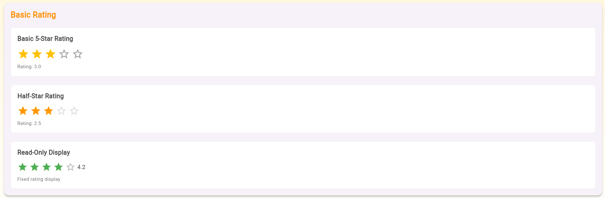
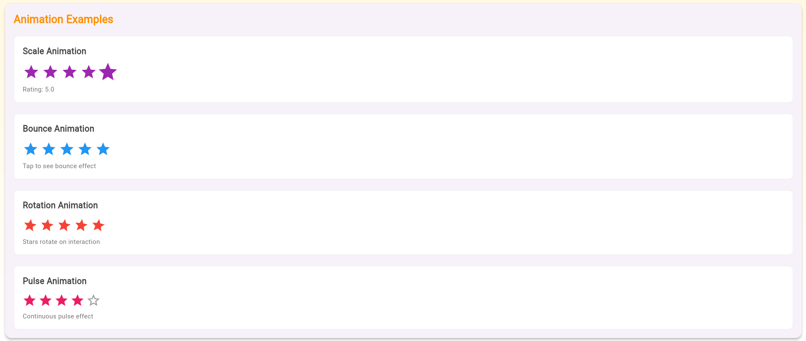
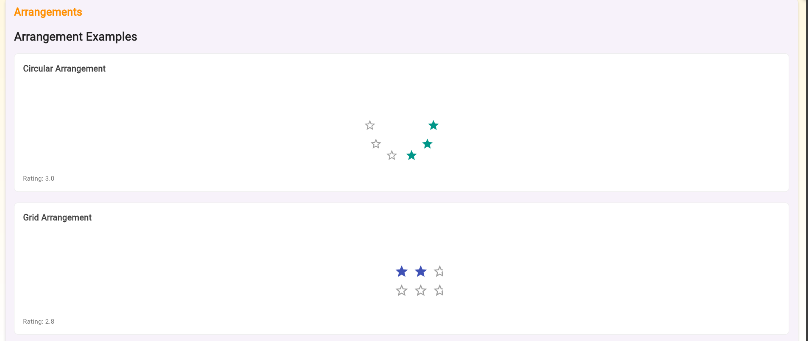
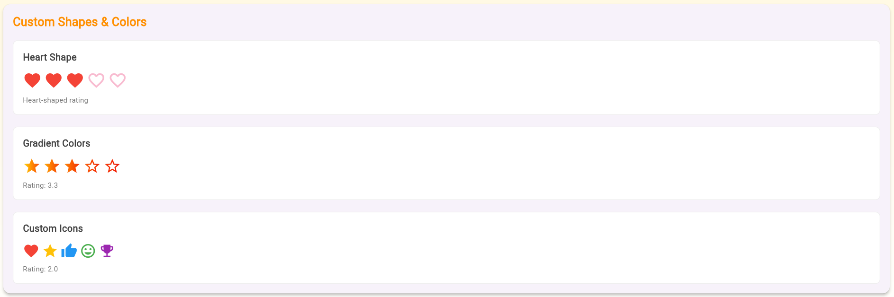
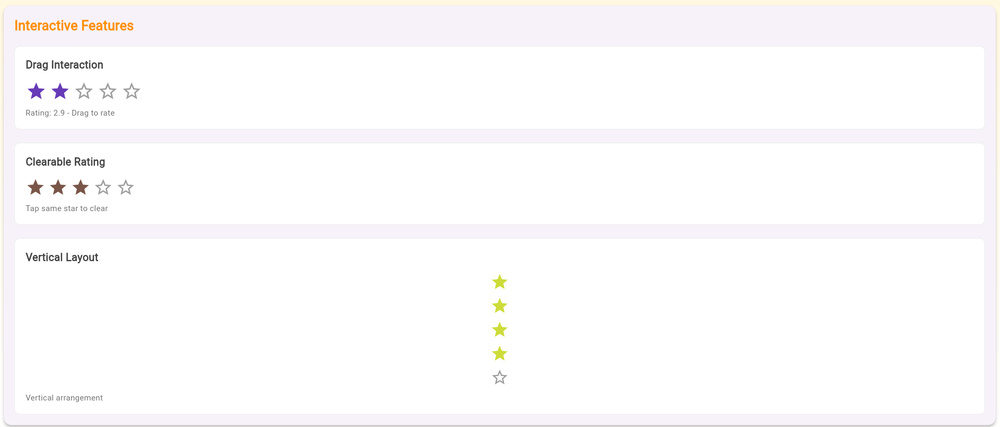
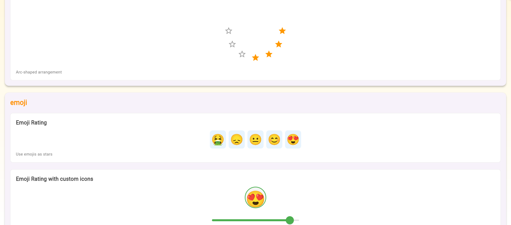
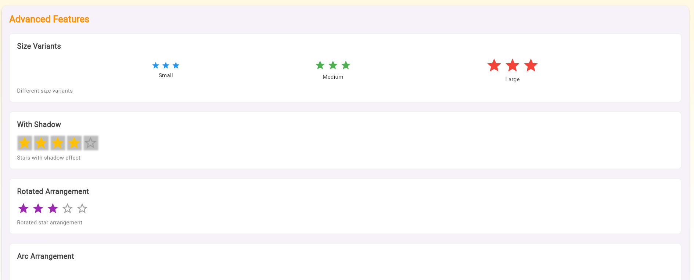
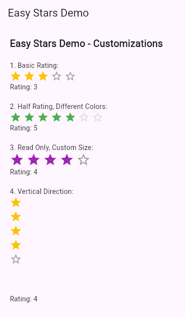

# ✨ Easy Stars: Your Flutter Rating Solution! ✨

Add a touch of sparkle to your Flutter app with **Easy Stars** — the all-in-one solution for elegant and customizable rating widgets. Whether you're collecting user feedback or displaying existing ratings, Easy Stars gives you total control over look, feel, and behavior.

---

## ⭐ Features

✅ **Interactive Ratings**
✅ **Static Displays**
✅ **Half-Star & Clearable Ratings**
✅ **Custom Shapes, Colors & Icons**
✅ **Smooth Animations (Scale, Bounce, Rotate, Pulse, etc.)**
✅ **Flexible Arrangements (Grid, Arc, Spiral, Wave, Vertical)**
✅ **Emoji & Slider Ratings**
✅ **Advanced Themes and Shadows**

---

## 🚀 Getting Started

Add the dependency in your `pubspec.yaml`:

```yaml
dependencies:
  easy_stars: ^1.0.0
```

Then run:

```bash
flutter pub get
```

---

## 💡 Example Usage

Below are rich examples showcasing the versatility of Easy Stars:

---

### 🌟 Basic 5-Star Rating

```dart
EasyStarsRating(
  initialRating: 3.0,
  onRatingChanged: (value) {
    setState(() {
      _rating = value;
    });
  },
)
```



---

### ⭐ Half-Star Rating

```dart
EasyStarsRating(
  initialRating: 2.5,
  allowHalfRating: true,
  filledColor: Colors.orange,
  onRatingChanged: (value) {
    setState(() {
      _rating = value;
    });
  },
)
```



---

### ✅ Read-Only Display

```dart
EasyStarsDisplay(
  initialRating: 4.2,
  readOnly: true,
  filledColor: Colors.green,
)
```



---

### ↕️ Vertical Layout

```dart
EasyStarsRating(
  initialRating: 4.0,
  direction: StarDirection.vertical,
)
```



---

### 💫 Animated Stars

#### Scale Animation

```dart
EasyStarsRating(
  initialRating: 5.0,
  animationConfig: StarAnimationConfig.scale,
)
```


---

#### Bounce Animation

```dart
EasyStarsRating(
  initialRating: 4.0,
  animationConfig: StarAnimationConfig.bounce,
)
```


---

### 🎨 Custom Shapes & Icons

#### Heart Shape

```dart
EasyStarsRating(
  initialRating: 3.0,
  starShape: StarShape.heart,
  filledColor: Colors.red,
)
```


---

#### Custom Icons

```dart
EasyStarsRating(
  initialRating: 2.0,
  customIcons: [
    Icons.favorite,
    Icons.star,
    Icons.thumb_up,
    Icons.mood,
    Icons.emoji_events,
  ],
  customColors: [
    Colors.red,
    Colors.amber,
    Colors.blue,
    Colors.green,
    Colors.purple,
  ],
)
```



---

### 🌀 Arrangements

#### Arc Arrangement

```dart
EasyStarsRating(
  initialRating: 4.0,
  arrangement: StarArrangement.arc,
  arrangementRadius: 80,
)
```



#### Grid Arrangement

```dart
EasyStarsRating(
  initialRating: 3.0,
  arrangement: StarArrangement.grid,
  gridColumns: 3,
)
```



---

### 🥳 Emoji Ratings

#### Discrete Emojis

```dart
EasyStarsEmoji(
  initialRating: 3.0,
  showRatingText: true,
)
```


---

#### Emoji Slider

```dart
EasyStarsEmojiSlider(
  initialRating: 4.5,
  showRatingText: true,
)
```


---

#### Custom Emojis

```dart
EasyStarsEmoji(
  initialRating: 4.0,
  customEmojis: ['😡', '😔', '😑', '😃', '🤩'],
  showRatingText: true,
)
```


---

## 📸 Full Preview



---

## 📚 Additional Resources

🔍 Explore more in the `example/` directory
🛠 Contribute or view source on [GitHub](https://github.com/Piyu-Pika/easy_stars)
🐞 Found a bug? [Open an issue](https://github.com/Piyu-Pika/easy_stars/issues)

---

## 🙌 Contributing

Pull requests and issues are welcome!

---

## 🏁 License

MIT © 2025 [Piyu-Pika](https://github.com/Piyu-Pika)

---

**Let your stars shine with Easy Stars!** 🌟


